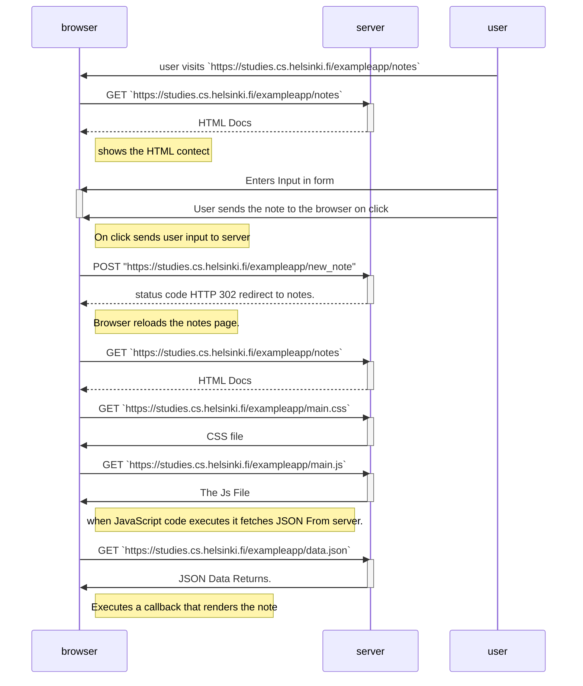

```mermaid
sequenceDiagram
    participant browser
    participant server
    participant user

    user ->> browser: user visits `https://studies.cs.helsinki.fi/exampleapp/notes`

    browser ->> server: GET `https://studies.cs.helsinki.fi/exampleapp/notes`
    activate server
    server -->> browser: HTML Docs
    deactivate server
    Note right of browser: shows the HTML contect

    user ->> browser: Enters Input in form
    activate browser
    user ->> browser: User sends the note to the browser on click
    deactivate browser
    Note right of browser: On click sends user input to server

    browser ->> server: POST "https://studies.cs.helsinki.fi/exampleapp/new_note"
    activate server
    server -->> browser: status code HTTP 302 redirect to notes.
    deactivate server
    note right of browser: Browser reloads the notes page.

    browser ->> server: GET `https://studies.cs.helsinki.fi/exampleapp/notes`
    activate server
    server -->> browser: HTML Docs
    deactivate server

    browser ->> server: GET `https://studies.cs.helsinki.fi/exampleapp/main.css`
    activate server
    server ->> browser: CSS file
    deactivate server

    browser ->> server: GET `https://studies.cs.helsinki.fi/exampleapp/main.js`
    activate server
    server ->> browser: The Js File
    deactivate server
    note right of browser: when JavaScript code executes it fetches JSON From server.

    browser ->> server: GET `https://studies.cs.helsinki.fi/exampleapp/data.json`
    activate server
    server ->> browser: JSON Data Returns.
    deactivate server
    note right of browser: Executes a callback that renders the note
```
