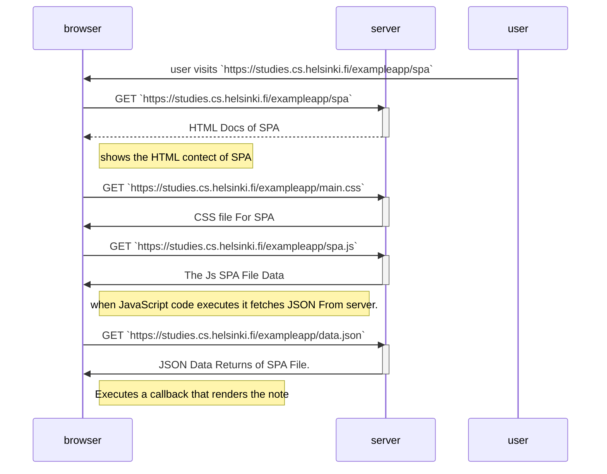

```mermaid
sequenceDiagram
    participant browser
    participant server
    participant user


    user ->> browser: user visits `https://studies.cs.helsinki.fi/exampleapp/spa`

    browser ->> server: GET `https://studies.cs.helsinki.fi/exampleapp/spa`
    activate server
    server -->> browser: HTML Docs of SPA
    deactivate server
    Note right of browser: shows the HTML contect of SPA

    browser ->> server: GET `https://studies.cs.helsinki.fi/exampleapp/main.css`
    activate server
    server ->> browser: CSS file For SPA
    deactivate server

    browser ->> server: GET `https://studies.cs.helsinki.fi/exampleapp/spa.js`
    activate server
    server ->> browser: The Js SPA File Data
    deactivate server
    note right of browser: when JavaScript code executes it fetches JSON From server.

    browser ->> server: GET `https://studies.cs.helsinki.fi/exampleapp/data.json`
    activate server
    server ->> browser: JSON Data Returns of SPA File.
    deactivate server
    note right of browser: Executes a callback that renders the note
```
