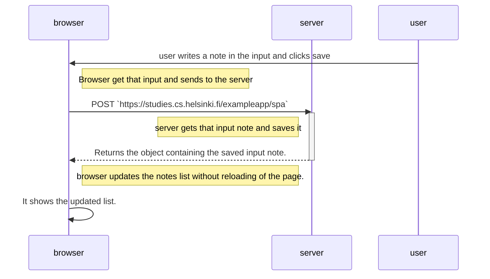

```mermaid
sequenceDiagram
    participant browser
    participant server
    participant user


    user ->> browser: user writes a note in the input and clicks save

    note right of browser: Browser get that input and sends to the server
    browser ->> server: POST `https://studies.cs.helsinki.fi/exampleapp/spa`
    activate server
    note left of server: server gets that input note and saves it
    server -->> browser: Returns the object containing the saved input note.
    deactivate server
    Note right of browser: browser updates the notes list without reloading of the page.

    browser ->> browser: It shows the updated list.
```